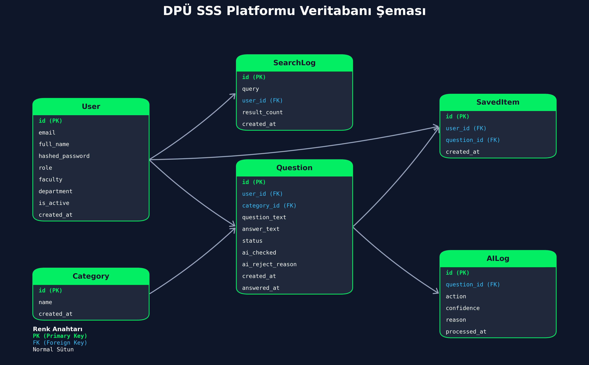

<div align="center">
  
# DPÜ SSS Platformu (AI Destekli Akıllı Soru-Cevap)

Modern, dinamik ve yapay zeka gücüyle desteklenen, Kütahya Dumlupınar Üniversitesi (DPÜ) öğrencileri için geliştirilmiş yeni nesil SSS (Sıkça Sorulan Sorular) platformu.

</div>

<br />

> [!IMPORTANT]
> Bu proje, geleneksel sıkıcı SSS sayfalarının aksine; öğrencilerin sorularını doğrudan **Google Gemini AI** tarafından anlamsal olarak analiz eden, otonom moderasyon uygulayan ve öğrencileri en doğru bilgiye en hızlı şekilde ulaştıran **dinamik** bir SSS platformudur.

---

## Öne Çıkan Özellikler

### Gelişmiş Yapay Zeka Entegrasyonları
- **Senaryo 1 (Doğrudan Cevap):** Öğrenci daha önce sorulmuş ve cevaplanmış bir soruyla aynı anlama gelen bir soru sorduğunda, yapay zeka (ChromaDB + Gemini Embeddings) soruyu anlamsal olarak eşleştirir ve anında "Tam İsabet" olarak cevabı getirir.
- **Senaryo 2 (Benzer Soru Tespiti):** Öğrenci, sisteme eklenmiş ancak henüz admin tarafından cevaplanmamış (bekleyen) benzer bir soru sorduğunda, AI "Bunu mu demek istediniz?" uyarısı verir. Öğrenci aynı soruyu tekrar havuza eklemek yerine o soruyu "Favorilere" ekleyebilir.
- **Senaryo 3 (Otonom Moderasyon):** Öğrenci yepyeni bir soru sorduğunda, metin anında AI Moderatörü tarafından analiz edilir. Laubali üslup, kaba dil, etik dışı içerik, küfür, hakaret veya siyasi ima taşıyan her türlü soru, yapay zeka tarafından reddedilir ve havuza alınmaz.
- **Admin Asistanı:** Adminlere, gelen soruların yazım yanlışlarını düzelten (normalize eden) ve otomatik olarak hangi kategoriye ait olabileceğini öneren bir AI asistanı eşlik eder.

### Modern & Estetik Kullanıcı Arayüzü
- **Glassmorphism:** Şeffaf cam efektleri, modern bulanık (blur) arka planlar.
- **Dinamik Animasyonlar:** Full-screen modal geçişleri, otomatik kapanan animasyonlu geri bildirim (toast) çubukları, interaktif "Hover" ve "Pulse" animasyonları.
- **DPÜ Kurumsal Renkleri:** Neon yeşil, koyu lacivert (slate) ve zengin zümrüt tonlarıyla tasarlanmış fütüristik gece (dark) modu.

---

## Veritabanı Mimarisi

Sistem **PostgreSQL** kullanmaktadır ve veritabanı tablolarımız **SQLAlchemy ORM** modeli ile yönetilmektedir.

Aşağıdaki veritabanı diyagramı, projedeki güncel şemayı birebir yansıtmaktadır:



### Tablolar ve İşlevleri:
- **`User` (Kullanıcılar):** Öğrenci, Personel ve Admin kayıtları burada tutulur.
- **`Category` (Kategoriler):** Soruların gruplandırıldığı SSS kategorileri.
- **`Question` (Sorular):** Sistemin merkez tablosu. Hem adminlerin cevapladığı aktif SSS'ler hem de öğrencilerin sorup cevap beklediği sorular (`status` alanı ile) burada tutulur.
- **`SavedItem` (Favoriler):** Öğrencilerin takip etmek için kaydettiği veya "Bunu mu demek istediniz?" önerisinde kaydedilen sorular burada tutulur.
- **`AILog` (Yapay Zeka Geçmişi):** Sistemdeki otonom AI moderatörünün hangi soruyu neden reddettiği veya onayladığı bu tabloda loglanır.
- **`SearchLog` (Arama Geçmişi):** Öğrencilerin platformda yaptıkları aramaların kaydedildiği istatistik tablosu.

---

## Kurulum & Çalıştırma (Docker)

Platform, tek bir komutla ayağa kaldırılabilmesi için **Docker Compose** ile konteynerize edilmiştir. 

### 1. Ortam Değişkenlerini Ayarlayın
Ana dizindeki ve backend dizinindeki `.env` dosyalarını yapılandırın. (Özellikle `GEMINI_API_KEY` ve veritabanı ayarları)

> [!WARNING]  
> API anahtarınız doğrudan kod içerisine yazılmaz, güvenliğiniz için sadece `.env` dosyasından okunur. Bu dosyayı asla Git'e pushlamayın!

### 2. Sistemi Başlatın
Tüm sistemi (PostgreSQL veritabanı, FastAPI backend, React frontend) aynı anda başlatmak için terminale şu komutu girin:
```bash
docker compose up -d
```

### 3. Uygulamaya Erişin
- **Frontend (Kullanıcı Arayüzü):** `http://localhost:5173`
- **Backend (API):** `http://localhost:8000`
- **Swagger API Dokümantasyonu:** `http://localhost:8000/docs`

---

## Teknolojik Altyapı

| Alan | Teknoloji | Açıklama |
| :--- | :--- | :--- |
| **Frontend** | React, TypeScript, Vite | Hızlı, dinamik ve modüler istemci arayüzü |
| **Stil / Tasarım** | Tailwind CSS, Lucide Icons | Glassmorphism ve modern UI estetiği |
| **Backend** | Python, FastAPI | Asenkron, yüksek performanslı, type-safe API |
| **Veritabanı** | PostgreSQL, SQLAlchemy | Güçlü ilişkisel veri yönetimi |
| **Vektör DB** | ChromaDB | Yapay zeka ile anlamsal (semantic) metin eşleştirme |
| **Yapay Zeka** | Google Gemini (2.5 Flash) | LLM, İçerik Moderasyonu, Vektör Gömme (Embedding) |
| **DevOps** | Docker, Docker Compose | Platform bağımsız, kolay ve güvenilir dağıtım |

---

